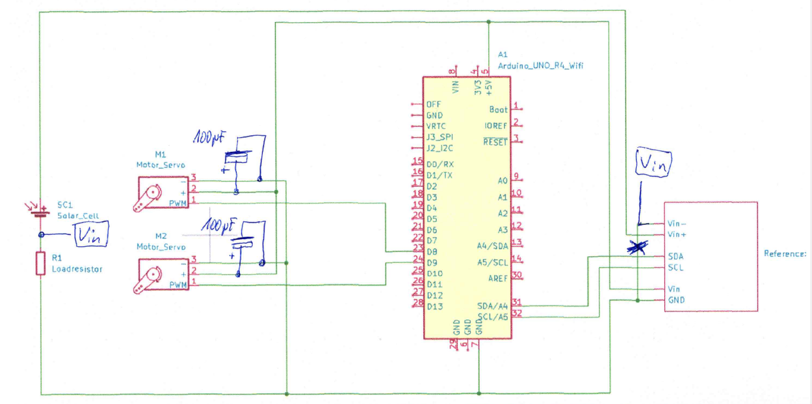
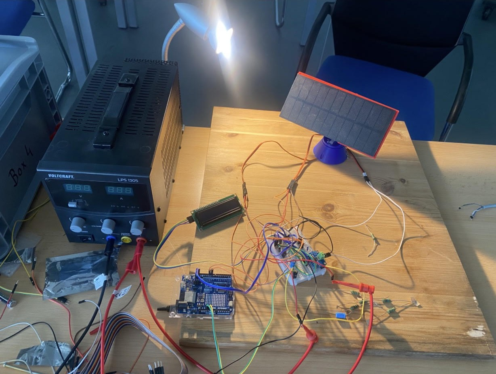
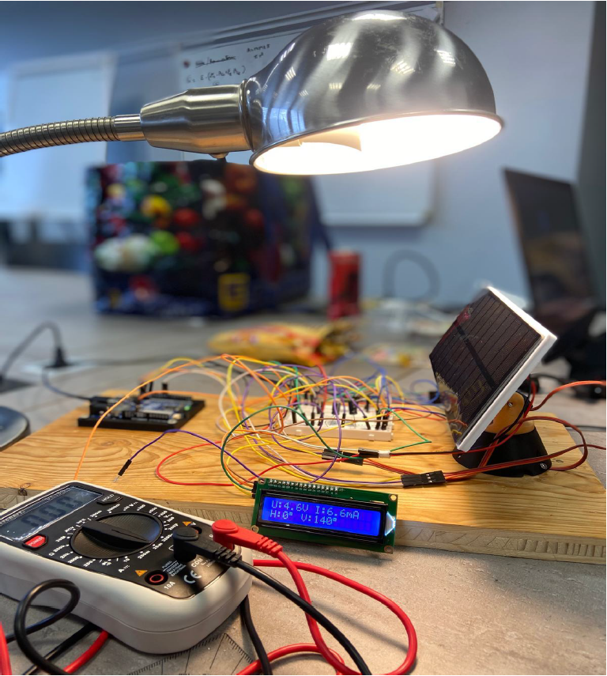
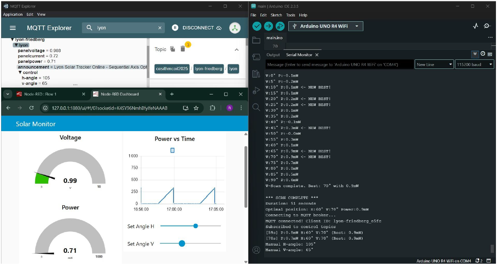

# 🌞 Solar Tracker — Arduino UNO R4 WiFi

> Dual-axis solar tracker with automatic grid-scan, manual servo control, energy accumulation, and real-time monitoring — controlled entirely via Serial interface.


-blue)


---

## 📋 Overview

This project implements a **dual-axis solar tracking system** on an Arduino UNO R4 WiFi. The panel is mounted on two servo motors (horizontal + vertical) and driven by a grid-scan algorithm that finds the orientation yielding maximum power output. The system measures voltage, current, and power in real time using an INA219 sensor and displays live data on a 16×2 LCD.

Beyond basic tracking, the firmware includes several additional features accessible at runtime via a Serial menu — no reprogramming needed to switch between modes.

The project was developed as part of an academic lab at **THM Friedberg – Fachbereich IEM**, using a 75 W lamp as a controlled light source in place of sunlight.

---

## 🛠️ Hardware

| Component | Description |
|---|---|
| Arduino UNO R4 Wi-Fi | Main microcontroller |
| INA219 (I²C, 0x40) | Voltage & current sensor (calibrated 16 V / 400 mA) |
| 2× Servo Motor | Horizontal (pin 8) & Vertical (pin 9), range 0–160° |
| 16×2 LCD (I²C, 0x27) | Live display of U, I, P and servo angles |
| Miniature solar panel | Lab-scale PV panel |
| Resistive loads (10–270 Ω) | Panel characterization at different operating points |
| 75 W halogen lamp | Stable, controllable substitute for sunlight |

### Schematic



---

## 📁 Project Structure

```
solar-tracker/
├── PS2-Code.ino          # Main Arduino sketch
├── schematic.png         # Circuit schematic
├── README.md
└── docs/                 # Photos and screenshots
```

---

## ⚙️ Software Architecture

The firmware is fully modular. Each subsystem is isolated into its own function group:

| Module | Role |
|---|---|
| `readPowerAvg()` | Averaged INA219 readings (voltage, current, power) |
| `rampTo()` | Smooth servo movement — avoids overshoot |
| `updateLCD()` | Formatted real-time display on 16×2 LCD |
| `scanForMax()` | 2D grid scan to find max power orientation |
| `energyAccumulationTest()` | Discrete power integration over time → Joules |
| `processSerialCommand()` | Serial parser dispatching to the 5 modes |

The main loop handles serial input non-blockingly and keeps the LCD updated when idle.

---

## 🖥️ Features — 5 Modes

All modes are accessible at runtime via the Serial Monitor (115200 baud):

```
===== SOLAR TRACKER =====
1 - AUTO TRACKING
2 - MANUAL SERVO CONTROL
3 - ENERGY ACCUMULATION
4 - VIEW LAST RESULTS
5 - LIVE MONITORING

Choose mode (1-5):
```

### Mode 1 — Auto Tracking
Performs a full 2D grid scan (H: 0–160°, V: 0–160°, step 20°). Moves the panel to the optimal position and enters continuous live monitoring.

```
H:20° V:80° -> P:0.018W
...
===== OPTIMAL POSITION FOUND =====
Best Position: H=20° V=80° P=0.018W
```

### Mode 2 — Manual Servo Control
Direct servo positioning via serial commands. Useful for reproducing specific angles or verifying servo accuracy.

```
H:angle   - Set horizontal angle (0-160)
V:angle   - Set vertical angle (0-160)
H:90 V:45 - Set both simultaneously
stop      - Return to menu
```

### Mode 3 — Energy Accumulation
Runs an auto-scan first to lock the panel at the optimal orientation, then accumulates energy (Joules) at 5-second intervals over a configurable duration (1–10 minutes).

```
duration:X  - Set duration (1-10 minutes)
start       - Start (auto-tracking runs first)
stop        - Return to menu
```

Example result after 3 minutes:
```
Total Energy: 3.1 Joules
Average Power: 0.017 W
Position: H=160° V=120°
```

Energy is calculated by discrete integration: **E (J) = Σ P(W) × Δt(s)**

### Mode 4 — View Last Results
Displays the last recorded optimal position and energy figures without re-running anything.

### Mode 5 — Live Monitoring
Continuous real-time display of U, I, P with servos fixed. Useful for stability checks and sensor drift observation.

---

## 📊 Results

### Panel Characterization (270 Ω load — best operating point)

| Angle | V (V) | I (mA) | P (mW) |
|---|---|---|---|
| 90° | 4.6 | 6.8 | 31.3 |
| 105° | 4.6 | 8.0 | 36.8 |
| **120°** | **4.6** | **8.1** | **37.3** |
| 135° | 4.6 | 7.4 | 34.0 |

Maximum power (~37.3 mW) consistently achieved at **120°** across all load values tested.

### INA219 Accuracy (vs. reference multimeter)

| Metric | Max deviation |
|---|---|
| Voltage | < 2% |
| Current | < 5% |

Reliable for real-time tracking and energy calculation.

### Tracking Performance

- Energy gain vs. fixed panel: **+15 to +30%**
- Scan duration: ~2–3 minutes
- Positioning accuracy: ±20° (limited by 20° scan step)

---

## 🔧 Setup

### Dependencies (Arduino IDE Library Manager)

- `Adafruit INA219`
- `LiquidCrystal I2C`
- `Servo` (built-in)

### Key Wiring

| Device | Arduino pin |
|---|---|
| INA219 SDA / LCD SDA | A4 |
| INA219 SCL / LCD SCL | A5 |
| Servo H | D8 |
| Servo V | D9 |

Solar panel → INA219 Vin+/Vin− → Load resistor → GND

### Flash & Run

1. Open `PS2-Code.ino` in Arduino IDE
2. Select **Arduino UNO R4 WiFi**
3. Upload → open Serial Monitor at **115200 baud**
4. Choose a mode (1–5)

> ⚠️ **Note:** The I²C LCD backlight can be sensitive to voltage fluctuations — ensure a stable 5 V supply to avoid premature backlight failure.

---

## 📸 Gallery

| Lab Setup | Live Measurement | MQTT Dashboard |
|---|---|---|
|  |  |  |

---

## 🔮 Future Improvements

- Finer scan resolution (5° steps) for higher tracking precision
- OLED display as LCD replacement
- MQTT / Wi-Fi data logging for long-term energy monitoring
- Closed-loop tracking (PID or hill-climbing) instead of open-loop grid scan
- Weatherproof enclosure for outdoor use

---

## 📄 License

MIT License — free to fork, adapt, and build on.

---

*Developed at THM Friedberg — Fachbereich IEM, Technische Informatik*
